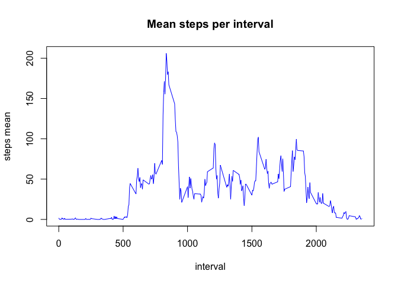

# Reproducible Research: Peer Assessment 1


## Loading and preprocessing the data

The source data format already suits most of the analysis that will be performed. No initial manipulation is required.

```r
data <- read.csv('activity.csv', stringsAsFactors = FALSE)
```


## What is mean total number of steps taken per day?

### Total steps per day
To graph the total number of steps per day, the data must be aggregated:

* aggregate by date.
* sum the number of steps taken for each day.

Following aggregation, the data can be graphed in a histogram.


```r
steps_per_day <- aggregate(data$steps, by = list(data$date), FUN='sum')
names(steps_per_day) <- c('date', 'steps')

steps_per_day <- steps_per_day[!is.na(steps_per_day$steps),]

hist(x = steps_per_day$steps, 
     breaks = 10,
     ylab = 'Frequency',
     xlab = 'Step Count',
     main = 'Histogram of step count',
     col = 'blue',
     border = 'yellow')
```

 

### Mean and median steps per day

The previously aggregated data can be used for mean/median calculations.


```r
original_mean <- mean(steps_per_day$steps, na.rm = TRUE)
original_median <- median(steps_per_day$steps, na.rm = TRUE)

original_mean
```

```
## [1] 10766.19
```

```r
original_median
```

```
## [1] 10765
```

## What is the average daily activity pattern?

### Average steps across 5 minute intervals

To show the average steps for each interval the data must be aggregated:

* by interval.
* calculate median of values for interval.

The data can then be plotted in a time series graph.


```r
steps_per_interval <- aggregate(data$steps, by = list(data$interval), FUN='mean', na.rm = TRUE)
names(steps_per_interval) <- c('interval','stepsmean')

plot(x = steps_per_interval$interval,
     y =  steps_per_interval$stepsmean,
     xlab = 'interval',
     ylab = 'steps mean',
     main = 'Mean steps per interval',
     type = 'l',
     col = 'blue')
```

 

### Interval with maximum average steps

The data aggregated in the previous step can be used to find which interval has the highest average number of steps across all days.


```r
steps_per_interval[steps_per_interval$stepsmean == max(steps_per_interval$stepsmean), 'interval']
```

```
## [1] 835
```


## Imputing missing values

### Counting missing values
The data set has missing step values across certain intervals. The missing data may impact calculations that have been performed.

To assess the impact firstly find the count of missing values


```r
sum(is.na(data$steps))
```

```
## [1] 2304
```

### Filling missing data
For the purposes of this analysis, the missing values will be filled in with the average step count for that interval across all days.

The impact of filling the missing values will the be analysed.

```r
filled_steps <- c()

for(i in 1:length(data$steps)) {
  
  ## pull out the steps and interval
  steps <- data$steps[i]
  interval <- data$interval[i]
  
  ## if the steps is NA, then find the average steps for that interval
  ## using the data calculated in the previous section.
  if (is.na(steps)) {
    steps <- steps_per_interval[steps_per_interval$interval == interval, 'stepsmean']
  }
  
  filled_steps <- append(filled_steps, steps)
}

## construct the new data frame
data_removena <- data.frame(filled_steps, data$date, data$interval)
names(data_removena) <- c('steps','date','interval')

steps_per_day <- aggregate(data_removena$steps, by = list(data_removena$date), FUN='sum')
names(steps_per_day) <- c('date', 'steps')
```

Now plot in histogram and calculate the mean and median.


```r
hist(x = steps_per_day$steps, 
     breaks = 10,
     ylab = 'Frequency',
     xlab = 'Step Count',
     main = 'Histogram of step count',
     col = 'blue',
     border = 'yellow')
```

 

```r
filled_mean <- mean(steps_per_day$steps, na.rm = TRUE)
filled_median <- median(steps_per_day$steps, na.rm = TRUE)
```


If the mean and median of the filled data set are compared against the original values, it can be seen the filled data set has a lower mean and median. This would imply that most of the missing values are from intervals when the person is doing no activity.

```r
data_comparison <- data.frame(c(original_mean, original_median),
                              c(filled_mean, filled_median),
                              row.names = c('Mean','Median'))
names(data_comparison) <- c('Original','Filled')

data_comparison
```

```
##        Original   Filled
## Mean   10766.19 10766.19
## Median 10765.00 10766.19
```

## Are there differences in activity patterns between weekdays and weekends?

### Classification of days

To analyse any activity difference between weekends and weekdays, each entry in the data set must be classified as a weekday or weekend.


```r
## function to will determine if a day of the week is a weekend or not
calculate_day_type <- function (day) {
  type <- NULL
  if(day %in% c('Saturday','Sunday')) {
    type <- 'weekday'
  }
  else {
    type <- 'weekend'
  }
  type
}

## convert string dates to dates data type
dates <- strptime(data_removena$date, '%Y-%m-%d')

## run the calculate_day_type function over all of the dates
day_types <- sapply(weekdays(dates), calculate_day_type)

## convert to a factor and add to the data frame
data_removena['day_type'] <- factor(day_types)
```

### Showing difference between weekdays and weekends

The data must first be aggregated

* group by interval and type of day.
* average values in the group.

Finally the data can be plotted.


```r
steps_per_interval <- aggregate(data_removena$steps, 
                                by = list(data_removena$interval,data_removena$day_type),
                                FUN='mean', 
                                na.rm = TRUE)

names(steps_per_interval) <- c('interval','day_type','steps_average')

library(ggplot2)
qplot(interval, 
      steps_average, 
      data = steps_per_interval, 
      facets = day_type~.,
      geom = 'line')
```

 
